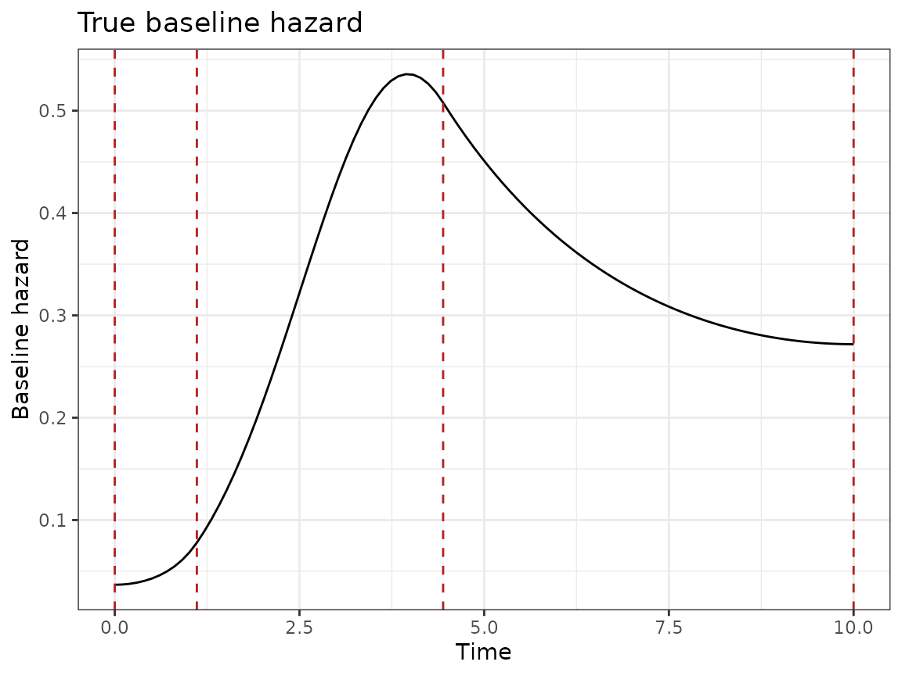
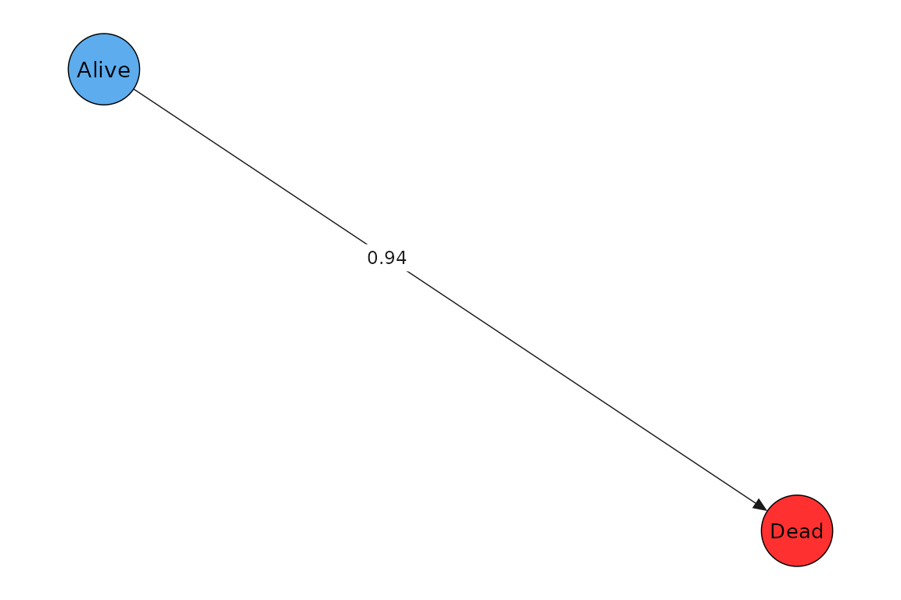
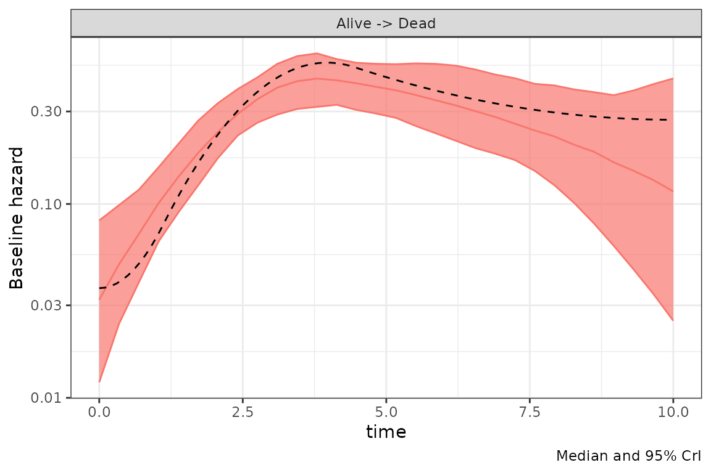
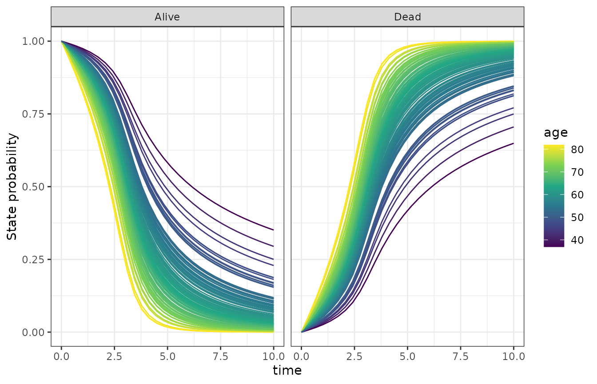

# Survival data analysis with the bmstate package

``` r
library(bmstate)
#> Attached bmstate 0.2.5. Type ?bmstate to get started.
library(ggplot2)
theme_set(theme_bw())
```

Here we first simulate right-censored survival data and then go through
the usual steps of a data analysis with the package.

## Simulating data

This is the setup and the definition of the true baseline hazard.

``` r
tmax <- 10
h0_true <- 0.1 # true baseline hazard intercept
num_knots <- 4
w <- matrix(c(-1, -1, 2, 1, 1), 1, num_knots + 1) # true spline weights
beta_age_true <- 0.5 # true effect size of age
mod <- create_msm(transmat_survival(),
  hazard_covs = "age",
  t_max = tmax,
  num_knots = num_knots
)
```

We create the model and plot the true baseline hazard. The red lines are
the knot locations used in data simulation.

``` r
tt <- seq(0, tmax, length.out = 100)
log_h <- mod$system$log_baseline_hazard(tt, log(h0_true), w[1, ])
df_h <- data.frame(time = tt, h0_true = exp(log_h))
ggplot(df_h, aes(x = time, y = h0_true)) +
  geom_line() +
  labs(x = "Time", y = "Baseline hazard") +
  geom_vline(
    xintercept = mod$get_knots(),
    lty = 2, color = "firebrick"
  ) +
  ggtitle("True baseline hazard")
```



We simulate subjects and events data.

``` r
set.seed(123)
simdat <- mod$simulate_data(
  w0 = h0_true, beta_haz = matrix(beta_age_true),
  w = w
)
#> Generating 100 paths
simdat$paths$plot_graph()
```



## Model setup: Setting knot locations

We set the spline knot locations based on quantiles of observed event
times.

``` r
event_times <- simdat$paths$transition_times()
mod$set_knots(t_max = tmax, t_event = event_times, num_knots = 4)
mod$get_knots()
#> [1]  0.000000  2.531165  3.700404 10.000000
```

## Fitting a model

``` r
fit <- fit_stan(mod, simdat,
  chains = 1, adapt_delta = 0.975,
  iter_warmup = 600,
  iter_sampling = 200
)
#> Using stan file at /home/runner/work/_temp/Library/bmstate/stan/msm.stan
#> Running MCMC with 1 chain...
#> 
#> Chain 1 Iteration:   1 / 800 [  0%]  (Warmup) 
#> Chain 1 Iteration: 100 / 800 [ 12%]  (Warmup) 
#> Chain 1 Iteration: 200 / 800 [ 25%]  (Warmup) 
#> Chain 1 Iteration: 300 / 800 [ 37%]  (Warmup) 
#> Chain 1 Iteration: 400 / 800 [ 50%]  (Warmup) 
#> Chain 1 Iteration: 500 / 800 [ 62%]  (Warmup) 
#> Chain 1 Iteration: 600 / 800 [ 75%]  (Warmup) 
#> Chain 1 Iteration: 601 / 800 [ 75%]  (Sampling) 
#> Chain 1 Iteration: 700 / 800 [ 87%]  (Sampling) 
#> Chain 1 Iteration: 800 / 800 [100%]  (Sampling) 
#> Chain 1 finished in 7.6 seconds.
```

## Sampling diagnostics

``` r
print(fit$info$diag)
#> $num_divergent
#> [1] 0
#> 
#> $num_max_treedepth
#> [1] 0
#> 
#> $ebfmi
#> [1] 0.7357373
```

``` r
print(max(fit$info$summary$rhat))
#> [1] 1.016208
```

## Inferred baseline hazard

We plot the inferred baseline hazard distribution and the true baseline
hazard (dashed line).

``` r
fit$plot_h0() + geom_line(df_h,
  mapping = aes(x = time, y = h0_true), inherit.aes = FALSE,
  lty = 2
)
```



## Inferred covariate effect

``` r
df_beta <- fit$covariate_effects()
df_beta
#>   covariate        beta target_state_idx target_state
#> 1       age 0.41 ± 0.11                2         Dead
```

## State occupancy probabilities

``` r
mfit <- fit$mean_fit() # use point estimate for speed here
p <- p_state_occupancy(mfit)
#> Recompiling Stan model
#> Using stan file at /home/runner/work/_temp/Library/bmstate/stan/msm.stan
#> calling solve_trans_prob_matrix 100 x 1 times
p <- p |> dplyr::left_join(fit$data$paths$subject_df, by = "subject_id")
ggplot(p, aes(
  x = .data$time, group = .data$subject_id, y = mean(.data$prob),
  color = .data$age
)) +
  facet_wrap(. ~ .data$state) +
  geom_line() +
  ylab("State probability") +
  scale_color_viridis_c()
```


